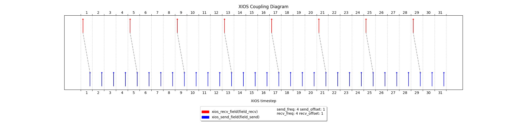

# Monodirectional coupling of a single field with no restart file

Firstly, let's start with an example without restarting file, which is useful if we do not need following runs. The coupling parameters are not realistic but they give an overview on how XIOS time parameters works with coupling, and how we should set `freq_op` and `freq_offset`. 
There are implemented two toy models (`ocn` and `atm`). Ocean is the model in charge of sending the field to the Atmosphere model.  



Xios timesteps start by convention from 1. Model `atm`(on top), will start using boundaries condition retrieved at @ts=1 sent by `ocn`. 

|  | Ocean | Atmosphere|
|----------|----------|----------|
|Start date|Jan 01, 2025|Jan 01, 2025 
| Duration  |  31d       | 31d         |
|Timestep| 6h | 6hd
| Send/recv frequency          | 4ts          | 4ts         |
This translates to:
| freq_op | 4ts| 4ts
| freq_offset | -3ts | 1ts|


## Algorithm explaination
XIOS handles the concept of time through the usage of the routine `xios_update_calendar(timestep)`, by which the user can set the current timestep before performing a `xios_send_field` `xios_recv_field`.
Furthermore, it is designed to start the coupling functionality from @ts=1, which effectively corresponds to the first time step (or @time = 0). Hence, we expect to run the coupling from @ts=1 (Jan 1) to @ts=31 (Jan 31) included.

### freq_op & freq_offset
These are two attributes used in xios for various tasks. In our coupling envirnonment:\
`freq_op` determines how often the operation (send or receive) is performed after the initial offset.\
`freq_offset` specifies the delay from `@ts=1` before performing the operation for the first time in XIOS, but: @TODO 
> **_NOTE:_**  At the current version of XIOS, in our coupling environment, with `freq_offset=0`, the first operation for **get** operations will be expected `@ts=0` while for **put** at `@ts=freq_op`. It's clear that to match our example in the plot, we have to offset the first send done by default `@ts=4` by -3ts and the first receive expected by default`@ts=0` by +1ts.

### xios_send_field & xios_recv_field
The routine `xios_recv_field` will return whatever is stored in the buffer that was sent using `xios_send_field`, independently of whether the current timestep is a coupling one. **For this reason, `xios_recv_field` should be called only on the "right" timesteps.**
```fortran
! Receive field starting from 1 with a certain frequency
IF (modulo(curr_timestep-1, freq_op) == 0) THEN
    CALL xios_recv_field("field2D_recv", field_recv)
    print *, "Model ", model_id, " received " , field_recv(1,1), " @ts = ", curr_timestep
END IF
```

# Output
```
 Model ocn x_start_date =         2025           1           1           0
           0           0
 Model ocn x_end_date =         2025           2           1           0
           0           0
 Model ocn sended @ts =           1
 Model ocn sended @ts =           2
 Model atm received    1.00000000000000       @ts =            1
 Model ocn sended @ts =           3
 Model ocn sended @ts =           4
 Model ocn sended @ts =           5
 Model atm received    5.00000000000000       @ts =            5
 Model ocn sended @ts =           6
 Model ocn sended @ts =           7
 Model ocn sended @ts =           8
 Model ocn sended @ts =           9
 Model atm received    9.00000000000000       @ts =            9
 Model ocn sended @ts =          10
 Model ocn sended @ts =          11
 Model ocn sended @ts =          12
 Model ocn sended @ts =          13
 Model atm received    13.0000000000000       @ts =           13
 Model ocn sended @ts =          14
 Model ocn sended @ts =          15
 Model ocn sended @ts =          16
 Model ocn sended @ts =          17
 Model atm received    17.0000000000000       @ts =           17
 Model ocn sended @ts =          18
 Model ocn sended @ts =          19
 Model ocn sended @ts =          20
 Model ocn sended @ts =          21
 Model atm received    21.0000000000000       @ts =           21
 Model ocn sended @ts =          22
 Model ocn sended @ts =          23
 Model ocn sended @ts =          24
 Model ocn sended @ts =          25
 Model atm received    25.0000000000000       @ts =           25
 Model ocn sended @ts =          26
 Model ocn sended @ts =          27
 Model ocn sended @ts =          28
 Model ocn sended @ts =          29
 Model atm received    29.0000000000000       @ts =           29
 Model ocn sended @ts =          30
 Model ocn sended @ts =          31
```


