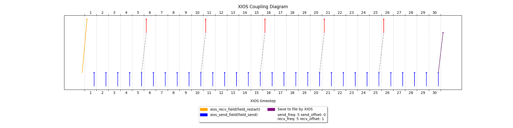

# Monodirectional coupling of a single field with restart file

This example shows the the coupling functionality between two contexts of their relative toy models (`ocn` and `atm`). Ocean is the model in charge of sending the field, to the Atmosphere model. The field is sent every 5 days, but the last one is not received and saved to file instead. The time parameters are again unrealistic but useful to understand the algorithm with restart file.


|  | Ocean | Atmosphere|
|----------|----------|----------|
|Start date|Apr 01, 2025|Apr 01, 2025 
| Duration  |  30d       | 30d         |
|Timestep| 1d | 1d
| Coupling freq          | 5ts          | 5ts         |
This translates to:
| freq_op | 5ts| 5ts
| freq_offset | 0ts | 6ts|
| (Restart field) freq_op | 1y *| 1y*
| (Restart field) freq_offset | 0ts | 1ts|


\* arbitrarily large, so to load one time during the run

## Algorithm explaination

As in OASIS we set a duration that is a multiple of the coupling frequency (`30d`). We will start indexing the timesteps from 1 as discussed in the first example. To reproduce the Oasis lag logic needed when the first get is done on the restarting file, we have to make sure that the send `@ts=5` has to be received by the atmosphere `@ts=6`, and so on. Then, `@ts=1` atm will receive the restart file, and after a coupling period (`@ts=6`) the coupling field.


### xios_send_field & xios_recv_field
`xios_send_field` logic is unchanged from example 1.\
As opposed to what happens with oasis GET, a restarting field should be set explicitly when calling the first `xios_recv_field`:

```fortran
!!! First reception is done explicitly on the restart field from the related file
IF (curr_timestep == 1) THEN
    CALL xios_recv_field("field2D_restart", field_recv)
    print *, "Model ", model_id, " received " , field_recv(1,1), " @ts = ", curr_timestep

ELSE IF (modulo(curr_timestep-1, freq_op) == 0) THEN
    CALL xios_recv_field("field2D_recv", field_recv)
    print *, "Model ", model_id, " received " , field_recv(1,1), " @ts = ", curr_timestep
END IF
```
The way XIOS is implemented, `ocn` will be in charge to send the restarting field to `atm`. For this reason, the restarting file reference is defined in `ocn` context.
```xml
<file_definition>
    ...
<!-- Restart file to READ (No output is done on this file) -->
<!-- output_freq refers to the reading frequency. mode is set up on "read" -->
<file id="restart_zerofield" name="restart_zerofield" enabled="true" type="one_file" output_freq="1y" mode="read">
    <!-- name attribute should be the same of the field in the nc file -->
    <field id="field2D_read" name="field2D_oce_to_atm" grid_ref="grid_2D" operation="instant" read_access="true"  />
</file> 

</file_definition>
```
Then, in addition to the coupling field, we refer to this field from file to send it to atm context.
```xml
<!-- OCEAN CONTEXT -->
<coupler_out_definition>
    <coupler_out context="atm::atm" >
        <field id="field2D_oce_to_atm" grid_ref="grid_2D" freq_op="5ts"/>
        <!-- Restart field-->
        <field id="field2D_restart" field_ref="field2D_read" freq_op="1y"/>
    </coupler_out>
</coupler_out_definition>
```
```xml
<!-- ATM CONTEXT -->
<coupler_in_definition>
    <coupler_in context="ocn::ocn" >
        <field id="field2D_oce_to_atm" grid_ref="grid_2D" freq_op="5ts" freq_offset="6ts" operation="instant" read_access="true"/>
        <!-- Restart field for atm is provided by ocean - freq_op big so to execute it only one time, offset to run it @ts=1 instead of @ts=0-->
        <field id="field2D_restart" grid_ref="grid_2D_restart" freq_op="1y" freq_offset="1ts" operation="instant" read_access="true"/>
    </coupler_in>
</coupler_in_definition>
```
To save the last send, we can tell XIOS to save the field in a file with a frequency that is the same as the duration of the run, so to execute it one time and only at the end of the run:
```xml
<!-- Save field on file after 30d (The last send, corresponding to the run duration)-->
<!-- It will create a new file called restart_next with the field and its timestemp-->
<file id="restart_next" name="restart_next" output_freq="30d" type="one_file" enabled="true">
    <field field_ref="field2D_oce_to_atm"  />
</file>
```
# Output
The toy model is made to send a value which corresponds to the current timestep that is traversing. The value received @ts=1 is the one in the restart file, which corresponds to a field generated in a previous run (2025-03-31 18:00:00). Note how we are effectively sending the data with a lag. 
```
 Model atm received   0.000000000000000E+000  @ts =            1
 Model ocn sended @ts =           1
 Model ocn sended @ts =           2
 Model ocn sended @ts =           3
 Model ocn sended @ts =           4
 Model ocn sended @ts =           5
 Model atm received    5.00000000000000       @ts =            6
 Model ocn sended @ts =           6
 Model ocn sended @ts =           7
 Model ocn sended @ts =           8
 Model ocn sended @ts =           9
 Model ocn sended @ts =          10
 Model atm received    10.0000000000000       @ts =           11
 Model ocn sended @ts =          11
 Model ocn sended @ts =          12
 Model ocn sended @ts =          13
 Model ocn sended @ts =          14
 Model ocn sended @ts =          15
 Model atm received    15.0000000000000       @ts =           16
 Model ocn sended @ts =          16
 Model ocn sended @ts =          17
 Model ocn sended @ts =          18
 Model ocn sended @ts =          19
 Model ocn sended @ts =          20
 Model atm received    20.0000000000000       @ts =           21
 Model ocn sended @ts =          21
 Model ocn sended @ts =          22
 Model ocn sended @ts =          23
 Model ocn sended @ts =          24
 Model ocn sended @ts =          25
 Model atm received    25.0000000000000       @ts =           26
 Model ocn sended @ts =          26
 Model ocn sended @ts =          27
 Model ocn sended @ts =          28
 Model ocn sended @ts =          29
 Model            1  is done
 Model ocn sended @ts =          30
 Model            0  is done
```
Using the command `ncdump restart_next.nc`, we should see our 10x10 field of 30's corresponding to the field on `2025-04-30 00:00:00`
